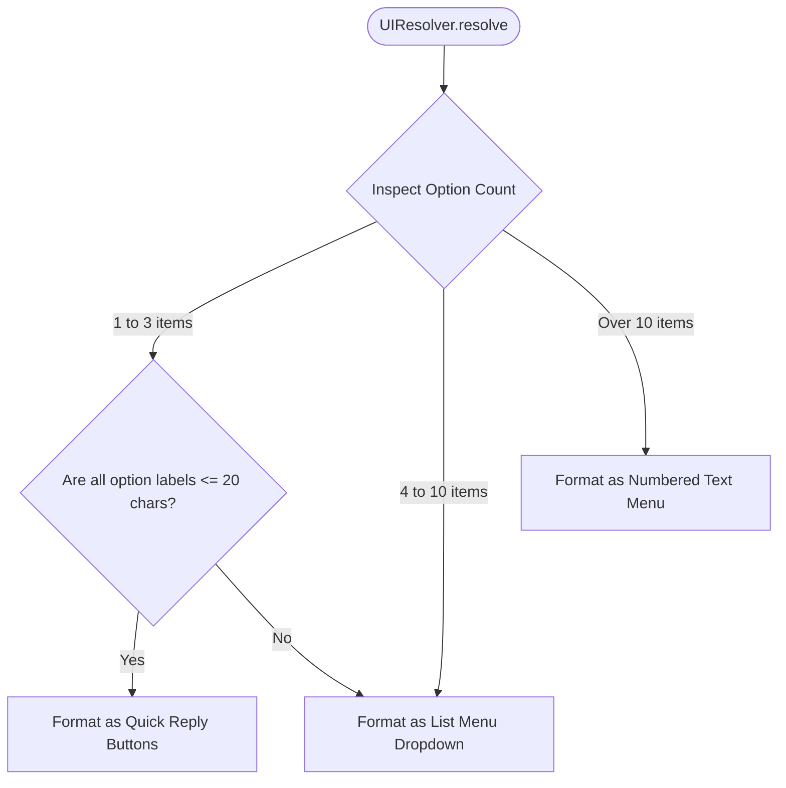
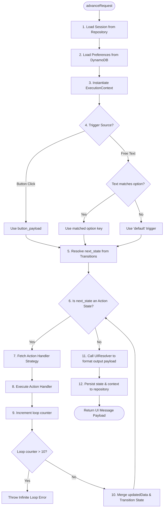
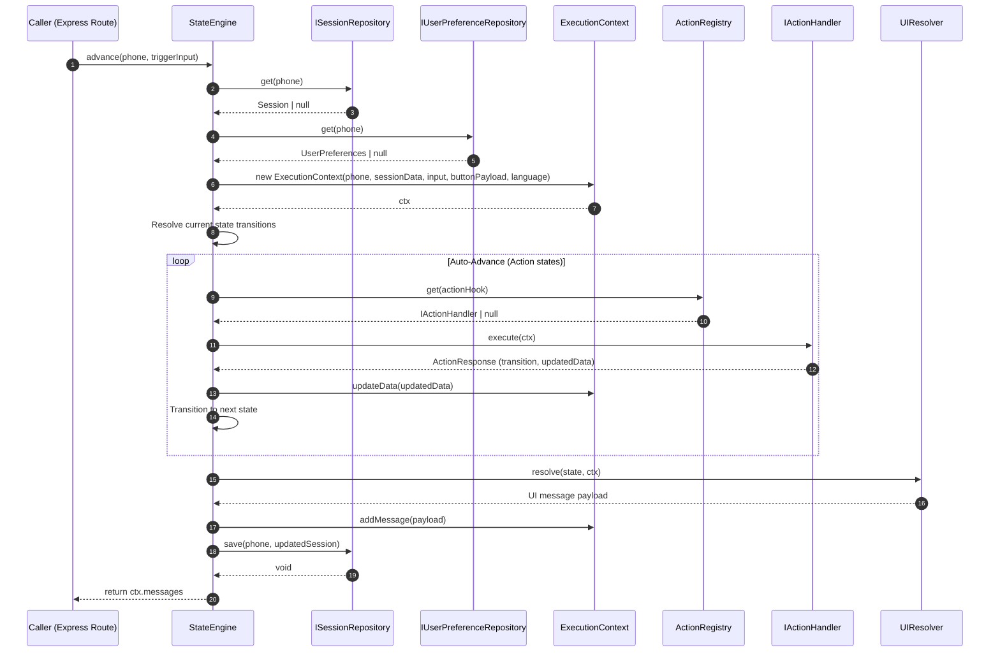

# Layer 1 Technical Specification — Engine Core & Ports Definition

This document defines the interface specifications, internal components, and runtime algorithms for the domain-agnostic **Engine Core & Ports** layer (Layer 1). This layer is designed to run in complete isolation from the database implementation and specific business logic domains.

---

## 1. Interface Specifications & Ports (`src/core/interfaces.ts`)

Ports establish abstract boundaries that separate the state machine's execution loop from external dependencies.

### Session Entity Interface
Represents the structural model of the active user session state:
```typescript
export interface Session {
  phone_number: string;
  current_state: string;
  language: string;
  context_data: Record<string, any>; // Arbitrary domain variables collected during the workflow (e.g. dairy_id, entry_date)
  updated_at: Date;
  created_at: Date;
}
```

### Persistence Port (`ISessionRepository`)
The repository abstraction that handles state persistence. The engine core executes operations strictly through this contract:
```typescript
export interface ISessionRepository {
  get(phone: string): Promise<Session | null>;
  save(phone: string, session: Session): Promise<void>;
  delete(phone: string): Promise<void>;
}
```

### Business Logic Port (`IActionHandler`)
The contract implemented by pluggable business domain action modules. Handlers return standard transition results back to the engine:
```typescript
export interface ActionResponse {
  transition: string;                // The resulting edge to traverse in the graph (e.g., "success", "invalid")
  updatedData?: Record<string, any>;  // Optional domain variables to merge into session context_data
}

export interface IActionHandler {
  execute(ctx: ExecutionContext): Promise<ActionResponse>;
}
```

### Action Registry Port (`IActionRegistry`)
The registry contract used by the engine core to resolve action hooks at runtime:
```typescript
export interface IActionRegistry {
  get(name: string): IActionHandler | null;
  register(name: string, handler: IActionHandler): void;
}
```

---

## 2. Transient Execution Context (`src/core/ExecutionContext.ts`)

The `ExecutionContext` represents a thread-safe, request-scoped context container initialized at the start of a request. It isolates session states, user inputs, and output messages during a single execution pass.

### Class Properties
* `phone_number: string` (The unique identifier of the active user in the communication channel)
* `session_data: Record<string, any>` (The context variables collected during the active session. Tenant-specific identifiers, such as dairy_id or store_id, are stored here dynamically)
* `user_input: string | null` (The raw text value submitted by the user)
* `button_payload: string | null` (The payload key returned from interactive elements)
* `language: string` (The active locale/language code)
* `messages: Array<any>` (The accumulated list of output message payloads to be sent to the client)

### API Methods
* `updateData(data: Record<string, any>): void`
  * Merges new key-value pairs into `session_data` (shallow merge).
* `addMessage(payload: any): void`
  * Appends a formatted message payload to the output queue.
* `getLanguage(): string`
  * Returns the active locale identifier.

---

## 3. UI Resolver & Schema Transformation (`src/core/UIResolver.ts`)

The `UIResolver` is a structural adapter. It transforms abstract state-rendering definitions from the workflow configuration file into platform-specific message templates, conforming dynamically to Meta Cloud API constraints.

### Adaptive Layout Resolution Flow



### WhatsApp API Schema Mappings

* **Quick Reply Payload Structure**: Used when option count is 3 or less and option labels do not exceed 20 characters.
  ```json
  {
    "type": "interactive",
    "interactive": {
      "type": "button",
      "body": { "text": "Body Text" },
      "action": {
        "buttons": [
          { "type": "reply", "reply": { "id": "option_value", "title": "Option Label" } }
        ]
      }
    }
  }
  ```

* **List Message Payload Structure**: Used when option count is between 4 and 10, or when any option label exceeds the 20-character limit.
  ```json
  {
    "type": "interactive",
    "interactive": {
      "type": "list",
      "header": { "type": "text", "text": "Options Menu" },
      "body": { "text": "Body Text" },
      "action": {
        "button": "Select Option",
        "sections": [
          {
            "rows": [
              { "id": "option_value", "title": "Option Label", "description": "" }
            ]
          }
        ]
      }
    }
  }
  ```

---

## 4. State Engine Orchestrator (`src/core/StateEngine.ts`)

The `StateEngine` manages the state traversal logic. It evaluates the incoming user inputs against the transition rules and runs the action execution loop.

### Engine Advancement Lifecycle Flow



### Engine Advancement Lifecycle Sequence



### Engine Advancement Lifecycle Algorithm


1. **Session Retrieval**: Queries the injected `ISessionRepository` using the user's phone number. If no session exists, instantiates a default session entity set to the initial state defined in the configuration workflow.
2. **Context Instantiation**: Creates a request-scoped `ExecutionContext` using the active session data, the incoming webhook triggers, and active locale. Any tenant context (like `dairy_id`) resides dynamically within the session's context data.
3. **Trigger Resolution**:
   * If a `button_payload` is present, it is evaluated as the immediate transition trigger.
   * Else if `user_input` is present, the engine checks if the text matches any option values defined in the current state configuration. If no match is found, it falls back to the `"default"` transition trigger.
4. **Transition Execution**: Resolves the target state key (`next_state`) from the current state's transitions using the trigger value.
5. **Action Execution Loop (Auto-Advance)**:
   * Inspects the target state configuration block.
   * If the state's `type` is `"action"`:
     * Resolves the handler strategy using `IActionRegistry.get(state.actionHook)`.
     * If a matching strategy is registered, invokes `await handler.execute(ctx)`.
     * Merges any returned `updatedData` values into the execution context.
     * Transitions the engine state using the returned transition key (`transitions[actionResponse.transition]`).
     * **Infinite Loop Guard**: Increment a loop execution counter. If the transition loop traverses more than 10 consecutive action states in a single webhook request, break the loop and transition to the system error state to prevent thread exhaustion.
   * If the state's `type` is not `"action"` (e.g., `"prompt"` or `"render"`), the engine exits the auto-advance loop.
6. **Payload Packaging**: Calls the `UIResolver` to transform the final state configuration and context data into the target platform response format, updates the session's active state, and saves the session via the persistence port.
