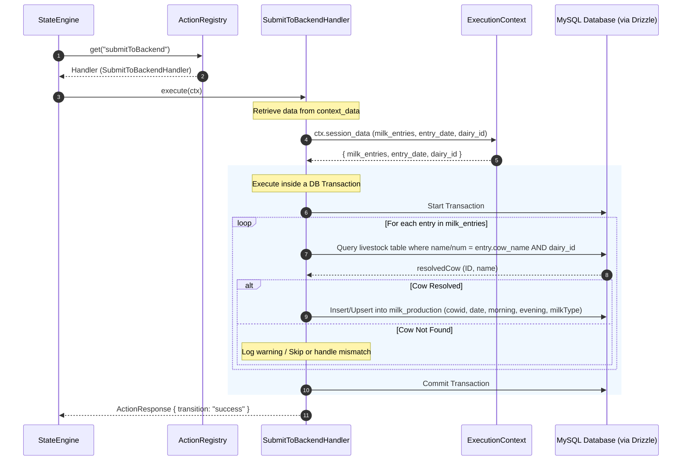

# Layer 2 Technical Specification — Business Logic Layer

This document specifies the technical design, directory layout, and contract implementations for the **Business Logic Layer** (Layer 2). This layer houses the domain-specific actions (e.g. Anand Dairy workflow handlers) that plug into the core state engine.

---

## 1. Core Architecture & Registries

The business logic layer communicates with the engine core strictly through the `IActionHandler` interface. Action strategies are loaded into a central registry on application startup.

### Action Registry Implementation (`src/core/ActionRegistry.ts`)
```typescript
import { IActionRegistry, IActionHandler } from "./interfaces";

export class ActionRegistry implements IActionRegistry {
  private registry: Map<string, IActionHandler> = new Map();

  public register(name: string, handler: IActionHandler): void {
    this.registry.set(name, handler);
  }

  public get(name: string): IActionHandler | null {
    return this.registry.get(name) || null;
  }
}
```

---

## 1.5 Domain Action Invocation Sequence

The following sequence diagram illustrates the lifecycle of a domain-specific action handler execution inside the state engine. We use `SubmitToBackendHandler` as a representative example to show the database transaction, livestock resolution, and production entry mapping.



---

## 2. Pluggable Dairy Domain Handlers (`src/domains/dairy/handlers.ts`)

This section documents the input parameters, data validation, Drizzle ORM operations, and transitions for the chatbot handlers of the Dairy domain.

### A. Authentication & Language Selection

#### `AuthenticateUserHandler` (`authenticateUser`)
* **Purpose**: Verifies if the sender's phone number is authorized in the system.
* **Input**: `ctx.phone_number`
* **Process**:
  * Query the `users` table:
    ```typescript
    const matched = await db.select()
      .from(users)
      .where(and(eq(users.phone_number, ctx.phone_number), eq(users.isActive, true)))
      .limit(1);
    ```
* **Output**:
  * **Success**: Returns transition `"authorized"` with `updatedData: { userName: matched[0].userName, dairy_id: matched[0].dairy_id }`.
  * **Failure**: Returns transition `"unauthorized"`.

#### `SetSelectedLanguageHandler` (`setSelectedLanguage`)
* **Purpose**: Configures the locale for the session based on the trigger.
* **Input**: `ctx.button_payload` (e.g. `"lang_en"`, `"lang_mr"`)
* **Process**: Map `"lang_en"` -> `"en"`, `"lang_mr"` -> `"mr"`.
* **Output**: Returns transition `"default"` with `updatedData: { language: resolvedLang }`.

---

### B. Core Navigation Handlers

#### `SetSelectedEntryTypeHandler` (`setSelectedEntryType`)
* **Purpose**: Registers the user's choice of transaction workflow.
* **Input**: `ctx.button_payload`
* **Output**: Returns transition matching the button value: `"addMilkProduction"` or `"addMilkConsumption"`.

#### `SetSelectedDateHandler` (`setSelectedDate`)
* **Purpose**: Sets the routing path based on date selection.
* **Input**: `ctx.button_payload`
* **Output**: Returns transition matching the selection: `"today"`, `"yesterday"`, or `"pastDate"`.

---

### C. Date Operation Handlers

#### `SetTodayDateHandler` (`setTodayDate` / `setTodayDateConsumption`)
* **Purpose**: Sets session transaction date to today in IST.
* **Process**: Resolves current IST date via `getIstDateString(0)`.
* **Output**: Returns transition `"default"` with `updatedData: { entry_date: dateStr }`.

#### `SetYesterdayDateHandler` (`setYesterdayDate` / `setYesterdayDateConsumption`)
* **Purpose**: Sets session transaction date to yesterday in IST.
* **Process**: Resolves yesterday's IST date via `getIstDateString(-1)`.
* **Output**: Returns transition `"default"` with `updatedData: { entry_date: dateStr }`.

#### `ValidateAndSetDateHandler` (`validateAndSetDate` / `validateAndSetDateConsumption`)
* **Purpose**: Validates custom typed past date input.
* **Input**: `ctx.user_input` (format: `DD/MM/YYYY`)
* **Process**:
  * Verify format matches regex `^\d{2}/\d{2}/\d{4}$`.
  * Parse date and verify it falls within the last 30 days.
* **Output**:
  * **Success**: Returns transition `"valid"` with `updatedData: { entry_date: parsedDate }`.
  * **Failure**: Returns transition `"invalid"`.

---

### D. Production Transaction Handlers

#### `ParseMilkProductionEntriesHandler` (`parseMilkProductionEntries`)
* **Purpose**: Parses text block containing cow-level morning/evening milk quantities.
* **Input**: `ctx.user_input` (Expected format: `CowName, M=X, E=Y` per line)
* **Process**:
  * Runs the production regex parser.
  * If valid, appends the parsed records to the session's `milk_entries` array.
* **Output**:
  * **Success**: Returns transition `"valid"` with `updatedData: { milk_entries: mergedList }`.
  * **Failure**: Returns transition `"invalid"`.

#### `SubmitToBackendHandler` (`submitToBackend`)
* **Purpose**: Resolves cow names to database IDs and commits production entries to MySQL.
* **Input**: `ctx.session_data.milk_entries`, `ctx.session_data.entry_date`, `ctx.session_data.dairy_id`
* **Process**:
  * Runs inside a database transaction:
    1. For each entry, query the `livestock` table where `name = entry.cow_name` or `num = entry.cow_name` AND `dairy_id = dairyId`.
    2. If resolved, insert or upsert record into the `milk_production` table:
       ```typescript
       await db.insert(milk_production).values({
         cowid: resolvedCow.id,
         productionDate: new Date(entry_date),
         morning: entry.morning,
         evening: entry.evening,
         milkType: "White"
       });
       ```
* **Output**:
  * **Success**: Returns transition `"success"`.
  * **Failure**: Returns transition `"failure"`.

---

### E. Consumption Transaction Handlers

#### `ParseMilkConsumptionEntriesHandler` (`parseMilkConsumptionEntries`)
* **Purpose**: Parses text block containing milk utilization purposes and quantities.
* **Input**: `ctx.user_input` (Expected format: `Purpose = Quantity` per line)
* **Process**:
  * Runs the consumption regex parser.
  * Appends parsed records to session `consumption_entries` array.
* **Output**:
  * **Success**: Returns transition `"valid"`.
  * **Failure**: Returns transition `"invalid"`.

#### `SubmitConsumptionToBackendHandler` (`submitConsumptionToBackend`)
* **Purpose**: Commits milk utilization entries to MySQL.
* **Input**: `ctx.session_data.consumption_entries`, `ctx.session_data.entry_date`, `ctx.session_data.dairy_id`
* **Process**:
  * For each entry, insert into `milk_utilization`:
    ```typescript
    await db.insert(milk_utilization).values({
      date: new Date(entry_date),
      milkPurpose: entry.purpose,
      consumedQuantity: entry.quantity,
      dairy_id: dairyId
    });
    ```
* **Output**:
  * **Success**: Returns transition `"success"`.
  * **Failure**: Returns transition `"failure"`.
