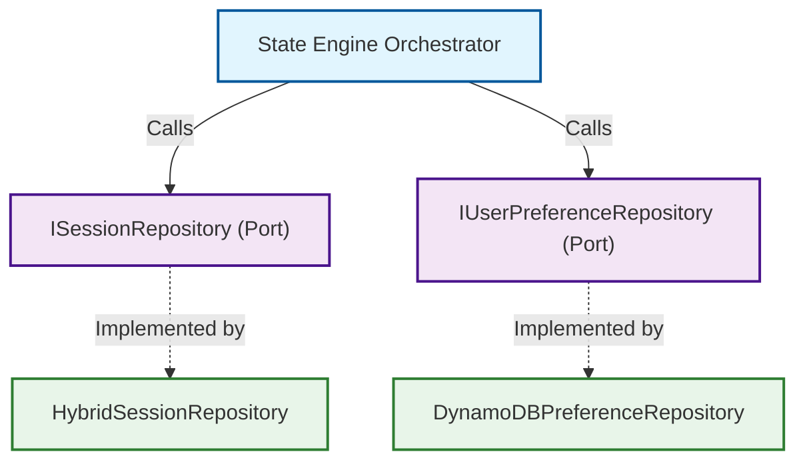
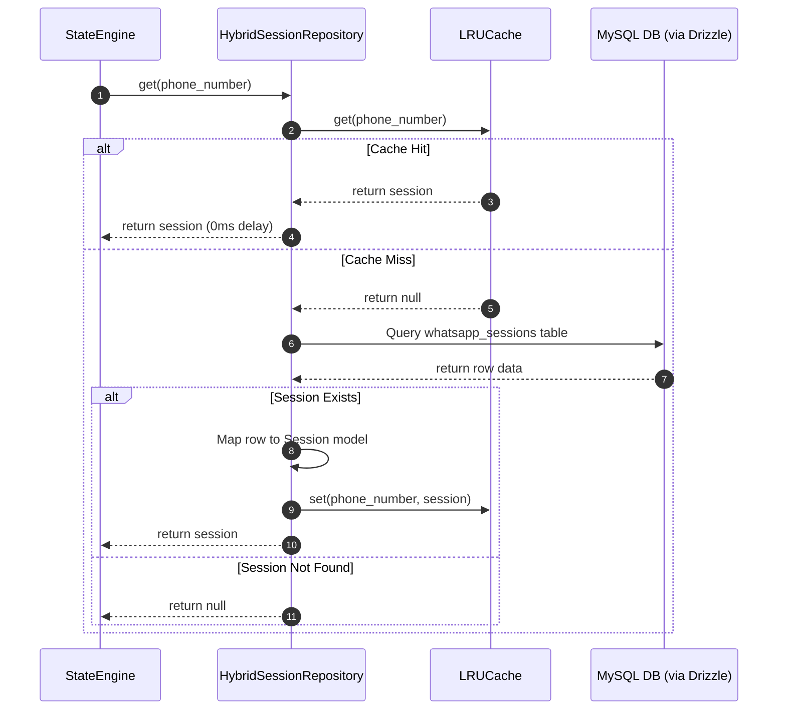
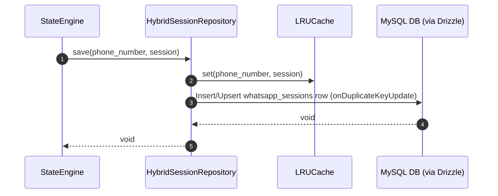

# Layer 3 Technical Specification — Metadata & Persistence Layer

This document specifies the technical design and contract implementation details for the **Metadata & Persistence Layer** (Layer 3). This layer abstracts all direct access to MySQL, Amazon DynamoDB, and in-memory caches, exposing clean repository contracts to the State Engine.

---

## 1. Technical Architecture & Flow

The persistence layer implements two ports defined in the core layer:
1. **`ISessionRepository`**: Manages temporary conversation states (MySQL + in-memory LRU cache).
2. **`IUserPreferenceRepository`**: Manages persistent user preferences like language selections (Amazon DynamoDB).



### A. Read-Through Session Retrieval

The sequence diagram below shows how the `HybridSessionRepository` checks the local cache and queries MySQL on a cache miss, ensuring high responsiveness.



### B. Write-Through Session Updates

The sequence diagram below shows how session state mutations are written to both the memory cache and persistent storage concurrently.




---

## 2. In-Memory Cache Implementation (`src/persistence/LRUCache.ts`)

To avoid memory leaks in production, we use a size-limited cache with a Least Recently Used (LRU) eviction strategy.

```typescript
export class LRUCache<K, V> {
  private capacity: number;
  private cache: Map<K, V> = new Map();

  constructor(capacity: number) {
    this.capacity = capacity;
  }

  public get(key: K): V | null {
    if (!this.cache.has(key)) return null;
    
    const val = this.cache.get(key)!;
    this.cache.delete(key);
    this.cache.set(key, val);
    return val;
  }

  public set(key: K, value: V): void {
    if (this.cache.has(key)) {
      this.cache.delete(key);
    } else if (this.cache.size >= this.capacity) {
      const leastRecentlyUsedKey = this.cache.keys().next().value;
      if (leastRecentlyUsedKey !== undefined) {
        this.cache.delete(leastRecentlyUsedKey);
      }
    }
    this.cache.set(key, value);
  }

  public delete(key: K): void {
    this.cache.delete(key);
  }
}
```

---

## 3. Database Schema Mappings

### MySQL Drizzle Mapping (`src/drizzle/schema.ts`)
Defines the transient session table in MySQL:
```typescript
import { mysqlTable, varchar, text, datetime, int } from "drizzle-orm/mysql-core";
import { dairy_master } from "./schema";

export const whatsapp_sessions = mysqlTable("whatsapp_sessions", {
  phone_number: varchar("phone_number", { length: 20 }).primaryKey(),
  dairy_id: int("dairy_id").notNull().references(() => dairy_master.id, { onDelete: "cascade" }),
  current_state: varchar("current_state", { length: 50 }).notNull().default("START"),
  context_data: text("context_data"),
  updated_at: datetime("updated_at").default(new Date()).onUpdateNow(),
  created_at: datetime("created_at").default(new Date()),
});
```

### Amazon DynamoDB Table Mapping
Defines the persistent user preference schema in DynamoDB:
* **Table Name**: `user_preferences`
* **Partition Key (Hash Key)**: `phone_number` (String)
* **Attributes**:
  * `language`: String (e.g. `"en"`, `"mr"`)
  * `updated_at`: String (ISO timestamp)

---

## 4. Port Expansion: Preference Storage (`src/core/interfaces.ts`)

We define a new port contract in Layer 1 to handle persistent user settings:

```typescript
export interface UserPreferences {
  phone_number: string;
  language: string;
}

export interface IUserPreferenceRepository {
  get(phone: string): Promise<UserPreferences | null>;
  save(phone: string, preferences: UserPreferences): Promise<void>;
}
```

---

## 5. DynamoDB Adapter Implementation (`src/persistence/DynamoDBPreferenceRepository.ts`)

We implement the preferences port using the AWS SDK v3 client:

```typescript
import { IUserPreferenceRepository, UserPreferences } from "../core/interfaces";
import { DynamoDBClient } from "@aws-sdk/client-dynamodb";
import { DynamoDBDocumentClient, GetCommand, PutCommand } from "@aws-sdk/lib-dynamodb";

export class DynamoDBPreferenceRepository implements IUserPreferenceRepository {
  private docClient: DynamoDBDocumentClient;
  private tableName = "user_preferences";

  constructor(region: string = "us-east-1") {
    const client = new DynamoDBClient({ region });
    this.docClient = DynamoDBDocumentClient.from(client);
  }

  /**
   * Retrieves persistent preferences from DynamoDB
   */
  public async get(phone: string): Promise<UserPreferences | null> {
    const command = new GetCommand({
      TableName: this.tableName,
      Key: { phone_number: phone }
    });

    const response = await this.docClient.send(command);
    if (!response.Item) {
      return null;
    }

    return {
      phone_number: response.Item.phone_number,
      language: response.Item.language
    };
  }

  /**
   * Commits preferences updates to DynamoDB
   */
  public async save(phone: string, preferences: UserPreferences): Promise<void> {
    const command = new PutCommand({
      TableName: this.tableName,
      Item: {
        phone_number: phone,
        language: preferences.language,
        updated_at: new Date().toISOString()
      }
    });

    await this.docClient.send(command);
  }
}
```

---

## 6. Hybrid Session Repository Specification (`src/persistence/HybridSessionRepository.ts`)

The session repository remains focused strictly on transient workflow session tracking (MySQL + LRU cache):

```typescript
import { ISessionRepository, Session } from "../core/interfaces";
import { LRUCache } from "./LRUCache";
import { db } from "../drizzle/drizzle.config";
import { whatsapp_sessions } from "../drizzle/schema";
import { eq } from "drizzle-orm";

export class HybridSessionRepository implements ISessionRepository {
  private cache: LRUCache<string, Session>;

  constructor(cacheCapacity: number = 1000) {
    this.cache = new LRUCache<string, Session>(cacheCapacity);
  }

  public async get(phone: string): Promise<Session | null> {
    const cached = this.cache.get(phone);
    if (cached) return cached;

    const rows = await db.select()
      .from(whatsapp_sessions)
      .where(eq(whatsapp_sessions.phone_number, phone))
      .limit(1);

    if (rows.length === 0) return null;

    const row = rows[0];
    const session: Session = {
      phone_number: row.phone_number,
      dairy_id: row.dairy_id,
      current_state: row.current_state,
      language: "en", 
      context_data: row.context_data ? JSON.parse(row.context_data) : {},
      updated_at: row.updated_at || new Date(),
      created_at: row.created_at || new Date(),
    };

    this.cache.set(phone, session);
    return session;
  }

  public async save(phone: string, session: Session): Promise<void> {
    this.cache.set(phone, session);

    const values = {
      phone_number: session.phone_number,
      dairy_id: session.dairy_id,
      current_state: session.current_state,
      context_data: JSON.stringify(session.context_data),
      updated_at: new Date(),
    };

    await db.insert(whatsapp_sessions)
      .values(values)
      .onDuplicateKeyUpdate({
        set: {
          current_state: values.current_state,
          context_data: values.context_data,
          updated_at: values.updated_at,
        }
      });
  }

  public async delete(phone: string): Promise<void> {
    this.cache.delete(phone);
    await db.delete(whatsapp_sessions)
      .where(eq(whatsapp_sessions.phone_number, phone));
  }
}
```
