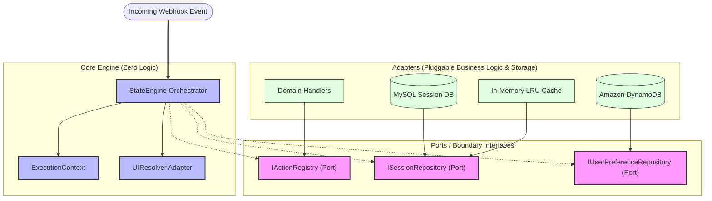
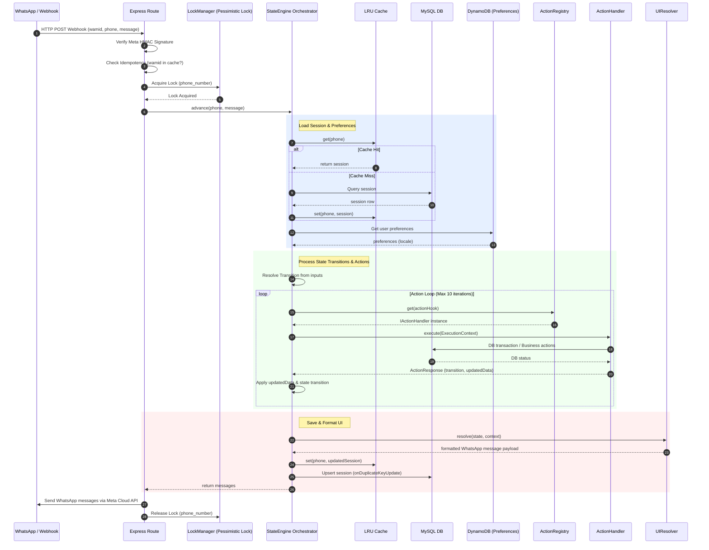

# Production-Grade Reusable State Engine — System Architecture Design

This document details the architectural specifications for a **business-logic-agnostic state machine engine** in Node.js. The system is designed using clean architecture patterns to achieve complete separation of core state routing, pluggable business rules, and the underlying persistence layer.

---

## 1. Architectural Patterns & Trade-offs

To satisfy the **core isolation principles**, we combine three key architectural patterns:



### A. Ports and Adapters (Hexagonal Architecture)
* **Design**: The Engine Core acts as the central Hexagon. It never depends directly on concrete implementations. Instead, it interacts with external boundaries (databases, WhatsApp APIs, business logic) via **Ports** (TypeScript interfaces).
* **Trade-off**: 
  * *Pros*: 100% testable using mock adapters. We can swap MySQL for DynamoDB or mock the WhatsApp client in unit tests without touching the engine code.
  * *Cons*: Adds indirection and requires interface definition boilerplates for every IO adapter.

### B. Strategy and Command Patterns
* **Design**: Action states in the configuration JSON reference hook names (e.g., `calculatePricing`). These hooks are resolved at runtime through a pluggable registry implementing the strategy pattern.
* **Trade-off**:
  * *Pros*: Adding new business behavior is as simple as registering a new class conforming to `IActionHandler`.
  * *Cons*: Requires rigid type validation to ensure inputs and outputs conform to contracts across decoupled modules.

### C. Dependency Injection (DI)
* **Design**: We inject the concrete `SessionRepository` and `ActionRegistry` into the `StateEngine` constructor on application boot.
* **Trade-off**:
  * *Pros*: Resolves coupling and prevents singleton anti-patterns.
  * *Cons*: Increases startup configuration complexity (mitigated by using simple factories or a DI container like InversifyJS).

---

## 1.5 End-to-End Request Lifecycle Sequence

The following sequence diagram outlines the flow of a single WhatsApp webhook event through the application stack, showing concurrency locking, caching, preferences lookup, action loop traversal, UI rendering, and database persistence.



---

## 2. Core Class and Module Breakdown

The system is decomposed into three decoupled layers:

### A. Engine Core Layer
* **`StateEngine`**: The orchestrator. Exposes `advance(phone, trigger, input)` which loads the session, steps through transitions, executes actions sequentially, and returns the next UI state.
* **`ExecutionContext`**: A container carrying the state parameters, accumulated payload data, active locale, and output message queue during a single execution loop.
* **`UIResolver`**: A structural mapper. Takes raw state configurations (e.g., `type: "render"`, `buttons`) and maps them to a generic, protocol-agnostic UI definition (e.g., text, selection buttons) to be dispatched by the channel adapter.

### B. Business Logic Layer
* **`IActionHandler` (Interface)**:
  ```typescript
  export interface IActionHandler {
    execute(ctx: ExecutionContext): Promise<{
      transition: string;
      updatedData?: Record<string, any>;
    }>;
  }
  ```
* **`ActionRegistry`**: A lookup container. Holds references to the registered `IActionHandler` strategies for the active business profile.

### C. Metadata & Persistence Layer
* **`ISessionRepository` (Interface)**:
  ```typescript
  export interface ISessionRepository {
    get(phone: string): Promise<Session | null>;
    save(phone: string, session: Session): Promise<void>;
    delete(phone: string): Promise<void>;
  }
  ```
* **`HybridSessionRepository`**: The concrete implementation. Implements a caching strategy combining an in-memory cache and a MySQL database (detailed in Section 4).

---

## 3. Generic JSON Configuration Schema

The configuration JSON defines the conversational graph. It is structured to separate state properties from business logic bindings:

```json
{
  "workflow": "milk_entry",
  "version": "2.2",
  "initialState": "authenticate",
  "states": {
    "welcome": {
      "type": "render",
      "message": {
        "text": "Welcome! Please select your language.",
        "buttons": [
          { "label": "English", "value": "lang_en" },
          { "label": "Marathi", "value": "lang_mr" }
        ]
      },
      "transitions": {
        "default": "languagePrompt"
      }
    },
    "languagePrompt": {
      "type": "prompt",
      "allowedInputs": ["lang_en", "lang_mr"],
      "transitions": {
        "default": "setLanguage"
      }
    },
    "setLanguage": {
      "type": "action",
      "actionHook": "setSelectedLanguage",
      "transitions": {
        "default": "mainMenu"
      }
    }
  }
}
```

---

## 4. Metadata & Persistence Cache Strategy

We utilize a **Write-Through / Read-Through** caching model inside `HybridSessionRepository` to balance speed and database reliability:

```mermaid
graph TD
    classDef main fill:#e1f5fe,stroke:#01579b,stroke-width:2px;
    classDef cache fill:#e8f5e9,stroke:#2e7d32,stroke-width:2px;
    classDef db fill:#fff3e0,stroke:#e65100,stroke-width:2px;

    Repo[HybridSessionRepository]:::main
    Cache[In-Memory Cache (LRU)]:::cache
    MySQL[(MySQL Database)]:::db

    %% Read Flow
    Repo -->|1. Read Session| Cache
    Cache -.->|2a. Cache Hit: Return| Repo
    Cache -->|2b. Cache Miss: Query| MySQL
    MySQL -.->|3. Populate & Return| Cache
    
    %% Write Flow
    Repo -->|4. Write Session (Atomic)| Cache
    Repo -->|5. Write Session (Atomic)| MySQL
```

### Read Operations (Read-Through)
1. Request for session `phone_number` arrives.
2. The repository checks the in-memory cache.
3. **Hit**: Returns session instantly (0ms network delay).
4. **Miss**: Queries MySQL, populates the in-memory cache with the result, and returns it.

### Write Operations (Write-Through)
1. When saving the updated session, the repository writes to the in-memory cache and MySQL database synchronously.
2. A database transaction wraps the MySQL write to guarantee durability, while the in-memory cache is updated in the same execution tick to ensure immediate read consistency on subsequent webhooks.

### Eviction Policy
* To avoid memory leaks, the in-memory cache implements a **Least Recently Used (LRU) eviction policy** with a Time-To-Live (TTL) of 30 minutes.

---

## 5. Pluggable Extension Example

Here is how two completely different businesses integrate their logic into the engine without modifying the core state engine code.

### Business 1: Dairy Operations (Milk Production Entry)
```typescript
import { IActionHandler, ExecutionContext } from "./interfaces";

export class SubmitProductionToBackend implements IActionHandler {
  async execute(ctx: ExecutionContext) {
    const { milk_entries, entry_date } = ctx.session_data;
    
    // Scoped business logic: Save to MySQL milk_production table
    await db.insert(milk_production).values(
      milk_entries.map((entry: any) => ({
        productionDate: new Date(entry_date),
        morning: entry.morning,
        evening: entry.evening,
        cowid: entry.cowid
      }))
    );
    
    return { transition: "success" };
  }
}
```

### Business 2: E-Commerce Bookstore (Pustakwala Orders)
```typescript
import { IActionHandler, ExecutionContext } from "./interfaces";

export class CalculateOrderTotal implements IActionHandler {
  async execute(ctx: ExecutionContext) {
    const { cart_items } = ctx.session_data;
    
    // Scoped business logic: Fetch books from catalog and sum prices
    let total = 0;
    for (const item of cart_items) {
      const book = await db.select().from(books).where(eq(books.id, item.bookId)).limit(1);
      total += (book[0]?.price || 0) * item.qty;
    }
    
    return { 
      transition: "calculated", 
      updatedData: { total_price: total } 
    };
  }
}
```

### Switching Businesses:
To switch from the Dairy bot to the Bookstore bot, you only modify the startup bootstrap file (`server.ts`):
```typescript
// For Dairy:
const registry = new ActionRegistry();
registry.register("submitToBackend", new SubmitProductionToBackend());
const engine = new StateEngine(registry, sessionRepo);

// To swap to Bookstore:
const registry = new ActionRegistry();
registry.register("submitToBackend", new CalculateOrderTotal());
const engine = new StateEngine(registry, sessionRepo);
```

---

## 6. Directory Structure

A clean, decoupled Node.js / TypeScript folder layout separating the generic engine from the specific chatbot integration:

### A. Standalone Project: `whatsapp-chatbot-state-engine`
This project publishes a generic, domain-agnostic state machine package:
```
whatsapp-chatbot-state-engine/
├── src/
│   ├── core/                        # ENGINE CORE (Zero Business Logic)
│   │   ├── StateEngine.ts           # State machine interpreter loop
│   │   ├── ExecutionContext.ts      # Transient request context container
│   │   ├── UIResolver.ts            # Maps abstract config UI to platform schemas
│   │   └── interfaces.ts            # Core Ports (ISessionRepository, IActionRegistry, etc.)
│   └── persistence/
│       └── LRUCache.ts              # Generic in-memory LRU Cache helper
├── package.json
└── tsconfig.json
```

### B. Chatbot Backend Integration: `backend`
The specific multi-tenant Express app containing database schemas and dairy business rules, importing the standalone engine:
```
backend/
├── src/
│   ├── drizzle/
│   │   └── schema.ts                # Defines users and whatsapp_sessions MySQL schemas
│   ├── routes/
│   │   └── whatsapp.routes.ts       # Webhook verification and listener routes
│   ├── server.ts                    # Application bootstrapper injecting adapters
│   └── whatsapp/
│       ├── state_workflow.json      # Shared conversational design file
│       ├── ActionRegistry.ts        # Pluggable handler lookup maps
│       ├── handlers.ts              # Pluggable dairy domain business actions (Drizzle queries)
│       ├── whatsapp.ts              # Meta Graph API sender client
│       ├── controller.ts            # Webhook controller (signatures, locks, wamid cache)
│       └── persistence/
│           ├── DrizzleSessionRepository.ts   # MySQL + LRU cache adapter (ISessionRepository)
│           └── DynamoDBPreferenceRepository.ts # AWS SDK DynamoDB user preferences adapter
```

---

## 7. Architectural Risks & Scaling Concerns

### A. Concurrent State Updates (Race Conditions)
* **Risk**: If a user double-clicks a WhatsApp quick-reply button, Meta fires two webhooks concurrently. Both request threads fetch the same session state, process transitions, and attempt to write back to the database, resulting in data corruption or duplicate transactions.
* **Mitigation**: Implement a **pessimistic lock** or **distributed lock** in the database layer. When a thread reads a session, it locks the row (`SELECT FOR UPDATE`) or creates a short-lived Redis lock based on the user's phone number. Concurrent requests for that number must wait until the active state machine transition finishes.

### B. Memory Leakage in In-Memory Caching
* **Risk**: Storing sessions in a basic JavaScript Map object inside the server process will eventually exhaust the server's heap memory as users scale.
* **Mitigation**: Use a dedicated, size-limited LRU cache library (e.g., `lru-cache`) that automatically evicts older records once the cache limit is reached. For multi-node deployments, replace the local in-memory cache with an external **Redis** instance.

### C. Circular Handler Imports
* **Risk**: Action handlers importing the orchestrator engine (or vice-versa) to trigger transitions creates tight coupling and runtime circular dependency crashes.
* **Mitigation**: Strict interface boundaries. Handlers must communicate strictly by returning standard payloads (e.g., `{ transition: string }`) to the engine core. They must never directly invoke engine transitions or call other handlers.

### D. Webhook Signature Verification (Spoofing Vulnerability)
* **Risk**: The API webhook URL is public. Malicious actors could send forged payloads containing fake numbers to trigger state loops or inject false transactions into database tables.
* **Mitigation**: Verify the signature sent by Meta in the `x-hub-signature-256` request header using a SHA-256 HMAC hash of the raw request body with the platform's `APP_SECRET` key. Reject unverified requests with a `403 Forbidden` response.

### E. Session Inactivity Expiry (Abandonment)
* **Risk**: A user stops interacting midway through a multi-step data entry workflow. If they message the bot hours later, they will be stuck in that sub-state, causing confusion.
* **Mitigation**: When loading a session, compare the current time with the session's `updated_at` timestamp. If the time difference exceeds a specified TTL (e.g., 15 minutes), clear the accumulated `context_data` and reset the state back to `START` before parsing the incoming trigger.

### F. Webhook Idempotency (Duplicate Processing)
* **Risk**: If processing a transaction takes longer than 5 seconds, Meta's webhook system assumes a timeout and retries sending the exact same payload. This results in duplicate database inserts.
* **Mitigation**: Maintain a fast-access in-memory cache of recently processed message IDs (`wamid`). If a webhook arrives with a `wamid` that matches an entry in the cache, immediately discard the request and return `200 OK`.

---

## 8. Shared Platform Services & Layout Constraints

### A. Localization Port (`ITranslationProvider`)
To keep the engine core completely agnostic of language dictionaries:
* **The Port**:
  ```typescript
  export interface ITranslationProvider {
    translate(key: string, locale: string, placeholders?: Record<string, string>): string;
  }
  ```
* **How it plugs in**: Each domain package bundles its own translation map files (e.g., `en.json`, `mr.json`). The `UIResolver` calls the provider dynamically during rendering to swap key strings.

### B. Adaptive UI Layout Resolution (WhatsApp Constraints)
Meta enforces strict layout rules on interactive messages:
* **Buttons Limit**: Quick reply button menus are limited to a maximum of 3 buttons.
* **Label Limit**: Button labels are capped at 20 characters.
* **Adaptive Mapping**: The `UIResolver` must dynamically inspect the workflow configuration's options array:
  * **1 to 3 items** (and labels <= 20 chars): Renders as a WhatsApp Quick Reply button array.
  * **4 to 10 items** (or labels > 20 chars): Renders as a WhatsApp **List Message** dropdown selector.
  * **Over 10 items**: Renders as an indexed text list, instructing the user to type the item number.

